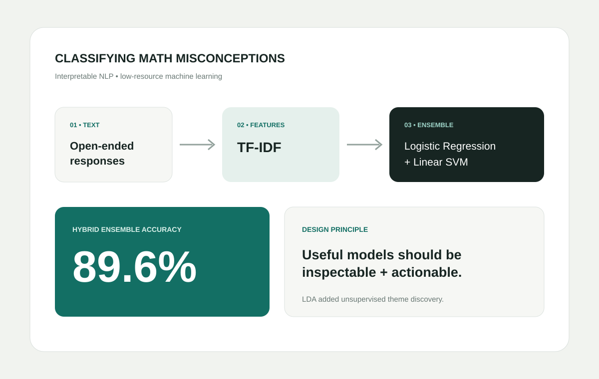

# Portfolio Image Guide

The site now ships with three original SVG project visuals, so there are no broken or empty project-image areas on first publish.

## Included project images

- `assets/images/projects/tape-dashboard.svg`
- `assets/images/projects/math-nlp.svg`
- `assets/images/projects/alpr-pipeline.svg`

These are lightweight, scalable, and work directly on GitHub Pages. They are intentionally designed like consulting case-study graphics rather than decorative stock photography.

## Best real images to add later

### 1. Profile image
Place a professional portrait at:

`assets/images/profile/nat-roberts.jpg`

Recommended crop: 4:5 portrait, at least 1200 × 1500 px. A clean or editorial headshot with a simple background will fit the site's consulting style.

### 2. Measuring TAPE
Best replacement: one strong R visualization, a cropped conference poster, or a polished figure from the organizational report. Export as PNG at 1600–2400 px wide. Avoid screenshots with tiny unreadable labels.

Suggested filename:

`assets/images/projects/tape-results.png`

### 3. Math Misconceptions
Best replacements: confusion matrix, model-comparison chart, or a simple pipeline diagram. If the project has a notebook figure, export the figure itself rather than taking a browser screenshot.

Suggested filename:

`assets/images/projects/math-results.png`

### 4. ALPR
Best replacement: a model prediction image showing a vehicle with the plate bounding box and OCR output. Blur/redact any real plate number if appropriate before publishing.

Suggested filename:

`assets/images/projects/alpr-demo.jpg`

## How to replace an included visual

In `projects.html` and `index.html`, find an image tag such as:

```html

```

Change only the `src` to the new file:

```html

```

Keep useful alt text for accessibility.

## Image optimization

For photographs, use JPG or WebP and aim for roughly 200–500 KB. For charts with text, PNG or SVG usually stays sharper. Do not upload multi-megabyte screenshots when a smaller export will look identical on the site.

## Recommended project case-study order

Each case study now follows a consulting-style structure:

1. Problem / context
2. Your role
3. Approach / methods
4. Key results
5. Why it matters / takeaway
6. Visual evidence
7. Tools / methods tags

When you add future projects, duplicate one existing `.case-study` section in `projects.html` and preserve this order.
